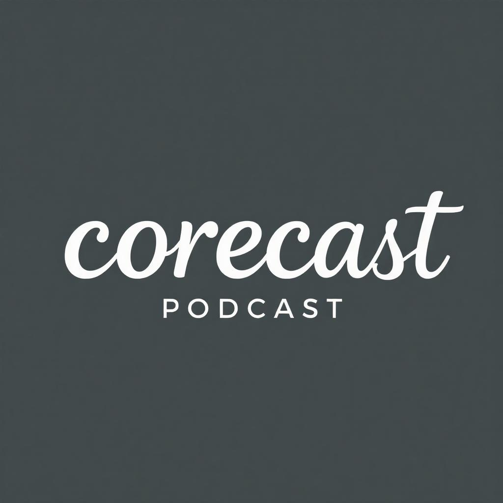

    preview do podcast

    <audio src="output/podcast_editado.MP3" controls title="Podcast editado"></audio>

# Projeto Podcast Gerado por I.A.s

## 💻 Tecnologias utilizadas no projeto

- [ChatGPT](https://chat.openai.com/) 
- [GENCRAFT](https://gencraft.com/generate)
- [ElevenLabs](https://beta.elevenlabs.io/)

## ✨ Como foi feito ?

- O Roteiro foi feito pelo ChatGPT
- O Audio foi gerado pela elevenLabs
- Gencraft Para gerar a capa

